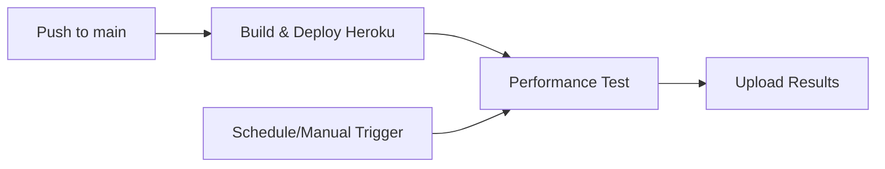

# k6 Performance Testing Guide

## Overview
Performance tests run against the **deployed Heroku application** (https://app2.anubhavsharma.dev) for realistic production metrics. Tests validate health checks, authentication, accounts, and transactions under controlled load while respecting strict rate limits.

## 📋 Test Triggers
| Trigger | Workflow | When | Target | How to View/Run |
|---------|----------|------|--------|-----------------|
| **Automatic** | `ci-cd.yml` | After every Heroku deployment | Production app | [GitHub Actions → ci-cd](https://github.com/anubhavsharmawork/fintech/actions/workflows/ci-cd.yml) |
| **Scheduled** | `performance-test.yml` | 1st & 15th of month @ 2 AM UTC | Production app | [GitHub Actions → k6 Performance Test](https://github.com/anubhavsharmawork/fintech/actions/workflows/performance-test.yml) |
| **Manual** | `performance-test.yml` | On-demand | Custom URL (optional) | Click "Run workflow" in Actions tab |

## Workflow Flow


## Test Configuration
**Script:** `k6/performance-test.js`

**Load Profile:**
- Stage 1: 30s ramp to 3 VUs
- Stage 2: 1m ramp to 5 VUs  
- Stage 3: 2m ramp to 10 VUs
- Stage 4: 1m hold at 10 VUs
- Stage 5: 30s ramp down

**Key Features:**
- Tests every 10th iteration: Login/Registration
- Tests every 3rd iteration: Transactions/Accounts
- 2-3s sleep between requests
- 429 responses treated as success (rate limiting)

## Production Success Criteria

| Metric | Threshold | Rationale |
|--------|-----------|-----------|
| Error rate | < 20% | Accounts for expected 429s |
| p95 Response time | < 500ms | Production target |
| Throughput | > 2 req/s | Realistic with sleeps |
| Login p95 | < 1s | Critical path |

**Rate Limits Accommodated:**
- Auth: 10 req/min
- Transactions: 30 req/min
- Accounts: 20 req/min

## Local Testing
```bash
# Install k6
brew install k6  # macOS
# Windows/Linux: see k6/README.md

# Start app
dotnet run --project ApiGateway

# Run tests
k6 run k6/performance-test.js
```

## Results & Monitoring
1. Visit [GitHub Actions](https://github.com/anubhavsharmawork/fintech/actions)
2. Filter by "k6 Performance Test"
3. Download artifacts for full HTML reports
4. Check README badges for pass/fail status

## Files Overview

**Created:**
- `k6/performance-test.js` – Main test script with multi-stage load testing
- `.github/workflows/performance-test.yml` – CI/CD workflow for automated tests
- `k6/README.md` – Detailed documentation

**Updated:**
- `README.md` – Added badges + performance testing section
- `ci-cd.yml` – Added post-deployment performance validation

## Key Benefits
- Automated performance validation on every change
- Early detection of performance regressions
- Production-realistic thresholds and load profiles
- GitHub badge visibility for CI/CD status
- Local testing + CI/CD integration coverage
- Zero-configuration setup
